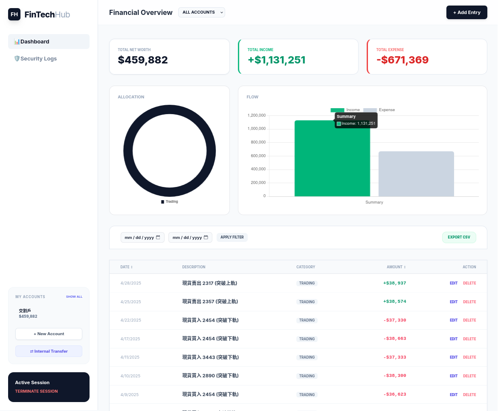

# FinHub



## Run server
```sh
git clone https://github.com/jackiesogi/FinHub
cd FinHub
uv python install 3.13
uv venv --python 3.13
uv sync

# Linux
source .venv/bin/activate
# Windows
.\.venv\Scripts\activate

# Open http://localhost:8000 after running the following command
uvicorn main:app --host 0.0.0.0 --port 8000 --reload
```
